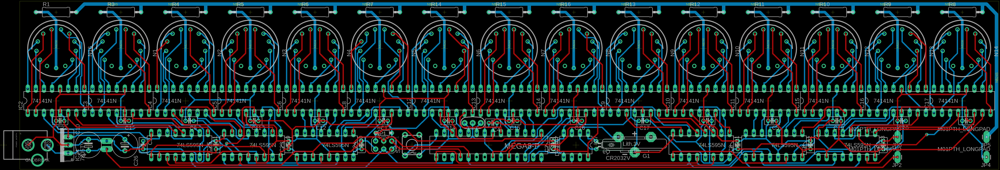
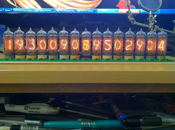

# mason
How many nixie tubes can one project use?

Growing up in New York, one of my favoriate places in the city was Union Square. There is this 15 digit clock in one of the buildings towrds the south, and I always wanted to make a desktop version of it. It is pretty cool how close nixie tubes look to the original curvy digit nature of the original Metronome, so I used 15 of them in a row and used the same scheme they used for counting up to and down from midnight.

